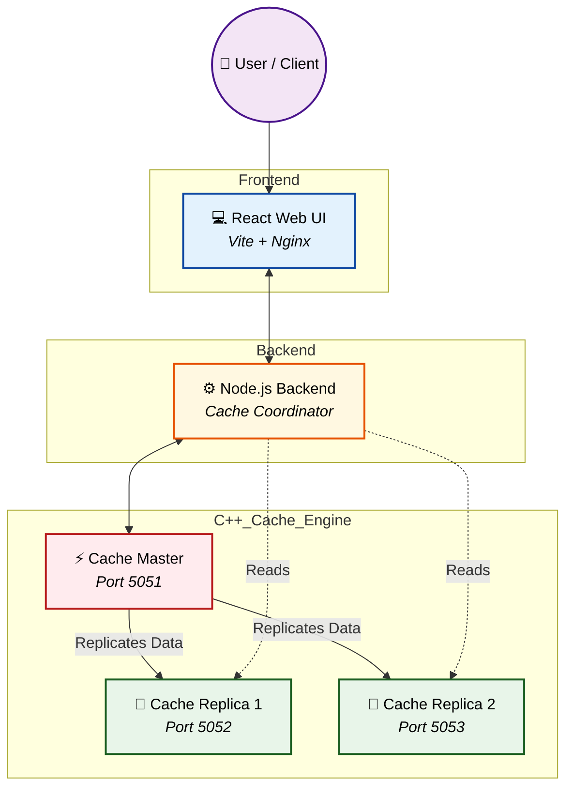

# ⚡ High-Performance Distributed Cache System

### Scalable, Fault-Tolerant In-Memory Data Grid

---

## 📖 Project Overview

**Distributed Cache System** is a robust, high-availability in-memory caching solution designed to provide lightning-fast data retrieval across distributed nodes. Built to handle massive scale, it features a primary-replica architecture for fault tolerance and seamless data synchronization.

Instead of relying on single-node caching bottlenecks, this platform offers a **decentralized caching grid** with **automatic replication**. It empowers applications to achieve sub-millisecond latencies, reduce database load, and scale horizontally with ease.

Equipped with a powerful **C++ Cache Engine**, a **Node.js Coordinator Backend**, and an intuitive **React Web Interface**, it provides both raw performance and effortless management.

---

## 🏗️ System Architecture

This application utilizes a distributed architecture, seamlessly integrating high-speed C++ caching nodes with a robust backend coordinator and a responsive UI.

### High-Level Architecture



---

## ⚙️ Engineering Pipeline

### 1. Frontend — Cache Dashboard

The web interface enables users and administrators to:

- Monitor cache node health in real-time
- View read/write latencies and hit ratios
- Manage cache keys and inspect values

Built with **React (Vite)** and served via **Nginx** for ultra-fast load times.

**Frontend Highlights:**

- Real-time metrics visualization
- Node status indicators
- Responsive and intuitive design

---

### 2. Backend — Node Coordinator

The backend acts as the bridge between clients and the cache grid, responsible for:

- Routing read/write requests
- Monitoring cache node health
- Distributing load efficiently

Powered by **Node.js**, ensuring asynchronous, non-blocking I/O orchestration.

---

### 3. Cache Engine — Core Performance

The beating heart of the system, designed for raw speed and reliability:

- Built purely in **C++** for optimal memory management
- Follows a **Master-Replica** topology
- Provides sub-millisecond read and write speeds
- Handles persistent data synchronization across peers

---

## 🔄 Data Workflow

Here’s the lifecycle of a cache operation:

1. **Client Sends Request**
   - Write or read command is issued via the API.

2. **Coordinator Routes Traffic**
   - Writes are directed to the **Cache Master**.
   - Reads are distributed across **Replicas**.

3. **Master Processes & Replicates**
   - Master updates in-memory storage and pushes state to Replicas.

4. **Engine Returns Response**
   - Acknowledgment or requested data is sent back.

5. **Dashboard Updates**
   - Frontend reflects new cache state and metrics.

---

## 🛠️ Key Features

| Feature                   | Implementation      | Benefit                        |
| ------------------------- | ------------------- | ------------------------------ |
| **Lightning Fast Engine** | C++ In-Memory Grid  | Sub-millisecond latency        |
| **Fault Tolerance**       | Master-Replica Sync | No single point of failure     |
| **Smart Routing**         | Node.js Coordinator | Optimized load balancing       |
| **Admin Dashboard**       | React Web UI        | Easy monitoring and management |
| **Containerized**         | Docker Compose      | One-click deployment           |

---

## 💻 Tech Stack

### Frontend

- **Framework:** React + Vite
- **Server:** Nginx

### Backend

- **Runtime:** Node.js
- **Architecture:** API Coordinator

### Cache Engine

- **Language:** C++
- **Architecture:** Custom Engine

### Infrastructure

- **Containerization:** Docker & Docker Compose

---

## 📌 Getting Started

### 1. Clone Repository

```bash
git clone https://github.com/Rudy-123/Distributed-Cache-System.git
cd Distributed_Cache_System
```

### 2. Deployment (Docker Compose)

The easiest way to spin up the entire cluster is using Docker Compose:

```bash
docker-compose up --build -d
```

### 3. Verify Services

Ensure all containers are running:

```bash
docker-compose ps
```

### 4. Access the Application

- **Frontend Dashboard:** `http://localhost:3000`
- **Coordinator API:** `http://localhost:5000`
- **Cache Engine Master:** `localhost:5051`

---

## 📌 Future Enhancements

- Consistent Hashing for automated sharding
- Eviction policies (LRU, LFU) configuration via UI
- Automatic master failover & leader election
- Persistent storage snapshots (AOF/RDB)

---

## 🤝 Contributing

We welcome contributions from everyone!

1. Fork the repository
2. Create a feature branch
3. Add tests & documentation
4. Submit a pull request

---

## 📄 License

This project is licensed under the **MIT License**.
See LICENSE file for more details.

---

## ⭐ Acknowledgements

Built with ❤️ to demonstrate high-performance distributed systems, C++ backend programming, and robust microservices architecture.
