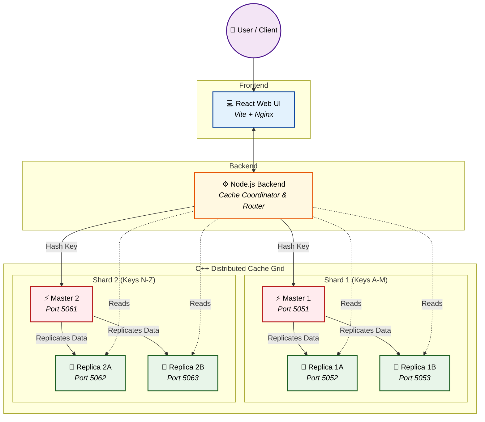

# ⚡ High-Performance Distributed Cache System

### Scalable, Fault-Tolerant In-Memory Data Grid with Sharding

---

## 📖 Project Overview

**Distributed Cache System** is a robust, high-availability in-memory caching solution designed to provide lightning-fast data retrieval across distributed nodes. Built to handle massive scale, it features a **sharded primary-replica architecture** for fault tolerance, seamless data synchronization, and horizontal scalability.

Instead of relying on single-node caching bottlenecks, this platform offers a **decentralized caching grid** partitioned into multiple shards, each with **automatic replication**. It empowers applications to achieve sub-millisecond latencies, reduce database load, and scale horizontally with ease by distributing data evenly across the cluster.

Equipped with a powerful **C++ Cache Engine**, a **Node.js Coordinator Backend**, and an intuitive **React Web Interface**, it provides both raw performance and effortless cluster management.

---

## 🏗️ System Architecture

This application utilizes a distributed architecture, seamlessly integrating high-speed C++ caching nodes with a robust backend coordinator and a responsive UI. The caching layer is partitioned into **multiple shards**, ensuring infinite horizontal scalability.

### High-Level Architecture (Sharded Master-Replica)



---

## ⚙️ Engineering Pipeline

### 1. Frontend — Cache Dashboard

The web interface enables users and administrators to monitor the cluster at a glance:

- **Cluster Topology View**: Visualize shards, masters, and replicas.
- **Node Health Monitoring**: Real-time heartbeat and status.
- **Performance Metrics**: View read/write latencies, throughput, and hit/miss ratios per node.
- **Data Inspection**: Manage cache keys and inspect values across different shards.

Built with **React (Vite)** and served via **Nginx** for ultra-fast load times.

---

### 2. Backend — Node Coordinator & Router

The backend acts as the intelligent bridge between clients and the cache grid, responsible for:

- **Consistent Hashing**: Routing requests to the appropriate shard based on the key's hash.
- **Read/Write Splitting**: Directing writes to the Shard Master and load-balancing reads across Shard Replicas.
- **Health Checks**: Monitoring node availability and dynamically updating the routing table if a replica goes down.

Powered by **Node.js**, ensuring asynchronous, non-blocking I/O orchestration.

---

### 3. Cache Engine — Core Performance

The beating heart of the system, designed for raw speed, reliability, and concurrency:

- Built purely in **C++** (using modern C++ features) for optimal memory management and minimal overhead.
- Follows a **Sharded Master-Replica** topology, allowing parallel processing of unrelated keys.
- Achieves sub-millisecond read and write speeds.
- Implements fast, persistent data synchronization across peers within a shard.

---

## 🔄 Data Workflow

Here’s the lifecycle of a cache operation:

1. **Client Sends Request**: Write or read command is issued via the API.
2. **Coordinator Hashes Key**: The backend determines which Shard is responsible for the key.
3. **Coordinator Routes Traffic**:
   - **Writes** are directed to the specific **Shard's Master**.
   - **Reads** are load-balanced across the **Shard's Replicas**.
4. **Master Processes & Replicates**: The Master updates its in-memory storage and asynchronously pushes the state to its Replicas.
5. **Engine Returns Response**: Acknowledgment or requested data is sent back to the Coordinator, then to the User.
6. **Dashboard Updates**: Frontend asynchronously fetches and reflects the new cache state and metrics.

---

## 🛠️ Key Features

| Feature                   | Implementation      | Benefit                        |
| ------------------------- | ------------------- | ------------------------------ |
| **Lightning Fast Engine** | C++ In-Memory Grid  | Sub-millisecond latency        |
| **Horizontal Scaling**    | Consistent Hashing  | Add shards to increase capacity|
| **Fault Tolerance**       | Master-Replica Sync | No single point of failure     |
| **Smart Routing**         | Node.js Coordinator | Optimized load balancing       |
| **Admin Dashboard**       | React Web UI        | Easy monitoring and management |
| **Containerized**         | Docker Compose      | One-click deployment           |

---

## 💻 Tech Stack

### Frontend
- **Framework:** React + Vite
- **Server:** Nginx
- **Styling:** CSS3 / TailwindCSS

### Backend
- **Runtime:** Node.js, Express
- **Architecture:** API Coordinator & Shard Router

### Cache Engine
- **Language:** C++17/C++20
- **Networking:** Custom TCP/HTTP Engine
- **Data Structures:** Highly optimized concurrent hash maps

### Infrastructure
- **Containerization:** Docker & Docker Compose

---

## 📌 Getting Started

### 1. Clone Repository

```bash
git clone https://github.com/Rudy-123/Distributed-Cache-System.git
cd Distributed_Cache_System
```

### 2. Deployment (Docker Compose)

The easiest way to spin up the entire cluster (Frontend, Backend, and multiple C++ Cache Nodes) is using Docker Compose:

```bash
docker-compose up --build -d
```
*(Note: If you want to scale up shards, you can modify `docker-compose.yml` to spin up more masters and replicas, and update the backend's routing config).*

### 3. Verify Services

Ensure all containers are running successfully:

```bash
docker-compose ps
```

### 4. Access the Application

- **Frontend Dashboard:** `http://localhost:3000`
- **Coordinator API:** `http://localhost:5000`
- **Cache Engine Master (Shard 1):** `localhost:5051`

---

## 📌 Future Enhancements

- **Automatic Failover:** Leader election algorithms (e.g., Raft or Paxos) to promote a replica if a master fails.
- **Dynamic Sharding:** Ability to rebalance data across shards on the fly when nodes are added or removed.
- **Eviction Policies:** Configurable strategies (LRU, LFU, TTL) per shard.
- **Persistent Storage Snapshots:** Periodic AOF/RDB snapshots to disk for disaster recovery.

---

## 🤝 Contributing

We welcome contributions from everyone!

1. Fork the repository
2. Create a feature branch (`git checkout -b feature/amazing-feature`)
3. Add tests & documentation
4. Commit your changes (`git commit -m 'Add some amazing feature'`)
5. Submit a pull request

---

## 📄 License

This project is licensed under the **MIT License**.
See `LICENSE` file for more details.

---

## ⭐ Acknowledgements

Built with ❤️ to demonstrate high-performance distributed systems, C++ backend programming, scalable sharding techniques, and robust microservices architecture.
