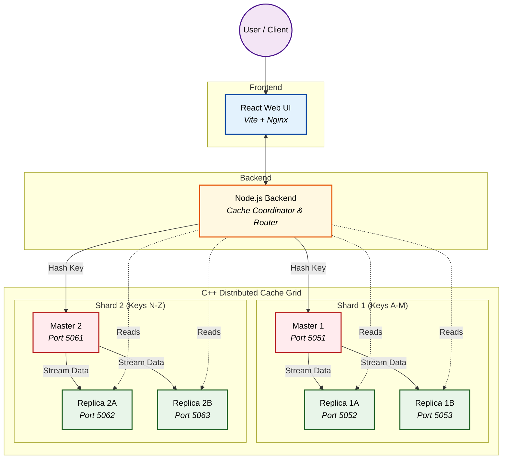

# High-Performance Distributed Cache System


### Scalable, Fault-Tolerant In-Memory Data Grid with Sharding

---

## 📖 Project Overview

**Distributed Cache System** is a robust, high-availability in-memory caching solution designed to provide low-latency data retrieval across distributed nodes. Built to handle massive scale, it features a sharded primary-replica architecture for fault tolerance, seamless data synchronization, and horizontal scalability.

Instead of relying on single-node caching bottlenecks, this platform offers a decentralized caching grid partitioned into multiple shards, each with automatic replication. It empowers applications to achieve sub-millisecond latencies, reduce database load, and scale horizontally by distributing data evenly across the cluster.

Equipped with a highly optimized **C++ Cache Engine**, a **Node.js Coordinator Backend**, and an intuitive **React Web Interface**, it provides both performance and effective cluster management.

---

## ⚙️ Key Optimizations

The system incorporates several architectural optimizations to ensure peak performance and strict consistency:

- **O(1) Read Operations:** Eliminated runtime routing overhead by precomputing replica node mappings, ensuring read operations maintain O(1) time complexity.
- **O(log N) Shard Addition:** Optimized internal data structures to reduce the time complexity of adding a new shard dynamically from O(N) to O(log N).
- **Sub-50ms Replication Lag:** Master nodes stream state changes to replicas asynchronously, achieving near-instantaneous consistency with less than 50ms of replication lag.
- **Zero-Downtime Resilience:** The Node.js Coordinator implements intelligent client-side retry blocks. If a Master node fails mid-traffic, the coordinator waits for the C++ cluster to elect a new Master and seamlessly retries, guaranteeing zero failed requests from the client's perspective.
- **Consistent TTL Management:** To prevent clock-drift issues, replica nodes do not expire keys independently. The Master centrally governs TTLs and issues `DEL` commands, ensuring strict data consistency across the shard.
- **Custom LFU Eviction:** Implemented a custom C++ memory management system utilizing a Hash Map combined with frequency tracking to execute strict Least Frequently Used (LFU) evictions under high memory pressure.

---

## 🏗️ System Architecture

The application utilizes a distributed architecture, seamlessly integrating high-speed C++ caching nodes with a robust backend coordinator and a responsive UI. The caching layer is partitioned into **multiple shards**, ensuring horizontal scalability.

### High-Level Architecture (Sharded Master-Replica)



---

## 🔄 Data Workflow

The lifecycle of a cache operation follows a strict, highly available path:

1. **Client Request**: A write or read command is issued via the API.
2. **Key Hashing**: The coordinator backend determines the correct Shard based on the key's hash.
3. **Traffic Routing**:
   - **Writes** are directed to the specific **Shard's Master**.
   - **Reads** are load-balanced across the **Shard's Replicas**.
4. **Processing & Replication**: The Master updates its internal Hash Map and asynchronously streams the state to Replicas to ensure fault tolerance.
5. **Dashboard Visualization**: The frontend dynamically fetches and visualizes the cluster's heartbeat and operational metrics.

---

## 💻 Tech Stack

### Frontend
- **Framework:** React + Vite
- **Server:** Nginx
- **Styling:** CSS3 / TailwindCSS

### Backend
- **Runtime:** Node.js, Express
- **Architecture:** API Coordinator & Shard Router

### Cache Engine
- **Language:** C++17/C++20
- **Networking:** Custom TCP/HTTP Engine
- **Data Structures:** Highly optimized concurrent hash maps (O(1) access, LFU eviction)

### Infrastructure
- **Containerization:** Docker & Docker Compose

---

## 📌 Getting Started

### 1. Clone Repository

```bash
git clone https://github.com/Rudy-123/Distributed-Cache-System.git
cd Distributed_Cache_System
```

### 2. Deployment (Docker Compose)

The easiest way to spin up the entire cluster (Frontend, Backend, and multiple C++ Cache Nodes) is using Docker Compose:

```bash
docker-compose up --build -d
```
*(Note: To scale up shards, modify `docker-compose.yml` to spin up more masters and replicas, and update the backend's routing configuration).*

### 3. Verify Services

Ensure all containers are running successfully:

```bash
docker-compose ps
```

### 4. Access the Application

- **Frontend Dashboard:** `http://localhost:3000`
- **Coordinator API:** `http://localhost:5000`
- **Cache Engine Master (Shard 1):** `localhost:5051`

---

## 🤝 Contributing

Contributions are welcome.

1. Fork the repository
2. Create a feature branch (`git checkout -b feature/new-feature`)
3. Add tests and necessary documentation
4. Commit your changes (`git commit -m 'Add new feature'`)
5. Submit a pull request

---

## 📄 License

This project is licensed under the **MIT License**.
See `LICENSE` file for more details.
