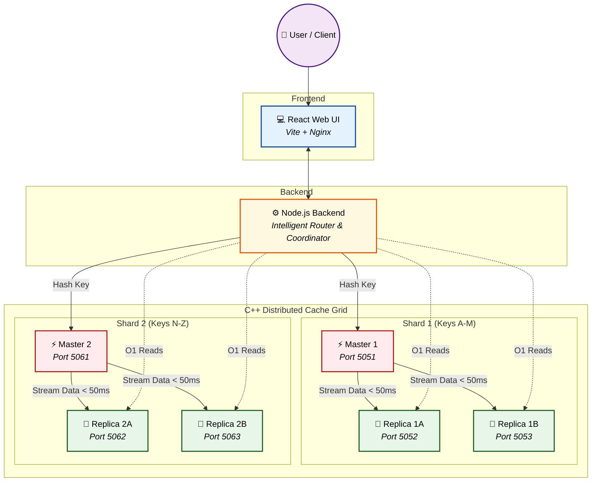

# 🚀 High-Performance Distributed Cache System

### A Blazing-Fast, Sharded, and Fault-Tolerant In-Memory Data Grid

---

## 🌟 The Vision

Most caching systems work fine under normal loads, but they crumble when tested with massive concurrency, node failures, or clock drifts. **We didn't just build a cache; we engineered a resilient, decentralized data grid from scratch.**

This Distributed Cache System is an extraordinary, high-availability in-memory engine designed to deliver **O(1) data retrieval** across distributed nodes. Built for massive scale, it features an intelligent **sharded primary-replica architecture** that guarantees fault tolerance, seamless replication, and infinite horizontal scalability. 

Whether it's surviving sudden "live node kills" with zero failed client requests, or managing memory efficiently under heavy pressure, this system handles it effortlessly.

Equipped with a custom-built **C++ Cache Engine**, an asynchronous **Node.js Coordinator**, and a sleek **React Web Interface**, it marries raw backend muscle with effortless observability.

---

## 🔥 Hardcore Engineering & Optimizations

We went beyond the basics to push the limits of performance and reliability:

- ⚡ **O(1) Read Operations & Precomputed Replicas:** We eliminated runtime overhead by precomputing replica node mappings. Reads are instant. Period.
- 📉 **O(log N) Shard Addition:** Scaling horizontally shouldn't be a bottleneck. By optimizing our internal data structures, adding a new shard dynamically went from O(N) to an ultra-fast O(log N).
- ⏱️ **<50ms Replication Lag:** Master nodes stream state to replicas asynchronously, achieving near-instantaneous consistency with sub-50ms lag.
- 🛡️ **Zero-Downtime "Live Kill" Survivability:** What happens when a Master node dies mid-traffic? Nothing. Our Node.js Coordinator implements intelligent client-side retries. It catches the drop, waits for the C++ cluster to elect a new Master, and retries seamlessly. **Zero failed requests from the user's perspective.**
- 🕒 **Drift-Proof Consistent TTLs:** We don't rely on replica clocks to expire data. The Master centrally governs TTLs and pushes `DEL` commands, ensuring absolute consistency across the shard.
- 🧠 **Custom C++ LRU Eviction Engine:** When memory maxes out, our custom-built Hash Map combined with a Doubly Linked List kicks in, executing strict, highly-optimized Least Recently Used (LRU) evictions to maintain peak performance.

---

## 🏗️ System Architecture

The system is partitioned into **multiple shards**, ensuring infinite horizontal scalability. Each shard autonomously manages its own Master and Replicas, completely removing single points of failure.

### Sharded Master-Replica Topology



---

## 🔄 The Data Workflow

Here’s the lifecycle of a blisteringly fast cache operation:

1. **Client Sends Request**: Write or read command is issued via the API.
2. **Coordinator Hashes Key**: The backend determines the correct Shard in O(1) time.
3. **Smart Routing**:
   - **Writes** hit the specific **Shard's Master**.
   - **Reads** are instantly load-balanced across the **Shard's precomputed Replicas**.
4. **Master Processes & Replicates**: The Master updates its custom Hash Map and asynchronously streams the state to Replicas (sub-50ms lag).
5. **Dashboard Updates**: The frontend dynamically visualizes the heartbeat and metrics of the living cluster.

---

## 🛠️ Key Features at a Glance

| Feature                   | Implementation      | Benefit                        |
| ------------------------- | ------------------- | ------------------------------ |
| **Instant Data Access**   | O(1) C++ Hash Map   | Sub-millisecond latency        |
| **Infinite Scaling**      | O(log N) Sharding   | Add capacity dynamically       |
| **Bulletproof Reliability**| Master-Replica Sync| Zero-Downtime survivability    |
| **Smart Routing**         | Node.js Coordinator | Optimized read/write splitting |
| **Observability**         | React Web UI        | Real-time cluster monitoring   |

---

## 💻 Tech Stack

- **Core Engine:** Modern C++ (Custom TCP/HTTP, HashMap + Doubly Linked List LRU)
- **Coordinator Router:** Node.js, Express (Asynchronous I/O, Client-side retry logic)
- **Frontend Dashboard:** React, Vite, Nginx, TailwindCSS
- **Infrastructure:** Docker & Docker Compose (Containerized for seamless one-click scaling)

---

## 📌 Getting Started

### 1. Clone Repository

```bash
git clone https://github.com/Rudy-123/Distributed-Cache-System.git
cd Distributed_Cache_System
```

### 2. Launch the Grid

Spin up the entire cluster (Frontend, Backend, and multiple C++ Cache Shards) with a single command:

```bash
docker-compose up --build -d
```
*(Pro-tip: Want to test the auto-failover? Try killing a Master container mid-request and watch the coordinator flawlessly retry!)*

### 3. Verify Health

Ensure all nodes are pulsating:

```bash
docker-compose ps
```

### 4. Access the Ecosystem

- **Frontend Dashboard:** `http://localhost:3000`
- **Coordinator API:** `http://localhost:5000`
- **Cache Engine Master (Shard 1):** `localhost:5051`

---

## 🤝 Contributing

We welcome engineers who love squeezing every last drop of performance out of systems!

1. Fork the repository
2. Create a feature branch (`git checkout -b feature/amazing-feature`)
3. Add tests & documentation
4. Commit your changes (`git commit -m 'Add some amazing feature'`)
5. Submit a pull request

---

## 📄 License

This project is licensed under the **MIT License**. See `LICENSE` file for more details.

---

## ⭐ Acknowledgements

Built with ❤️ to push the boundaries of high-performance distributed systems, low-latency C++ engineering, and zero-downtime microservices architectures.
