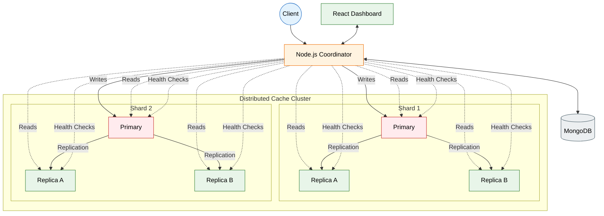
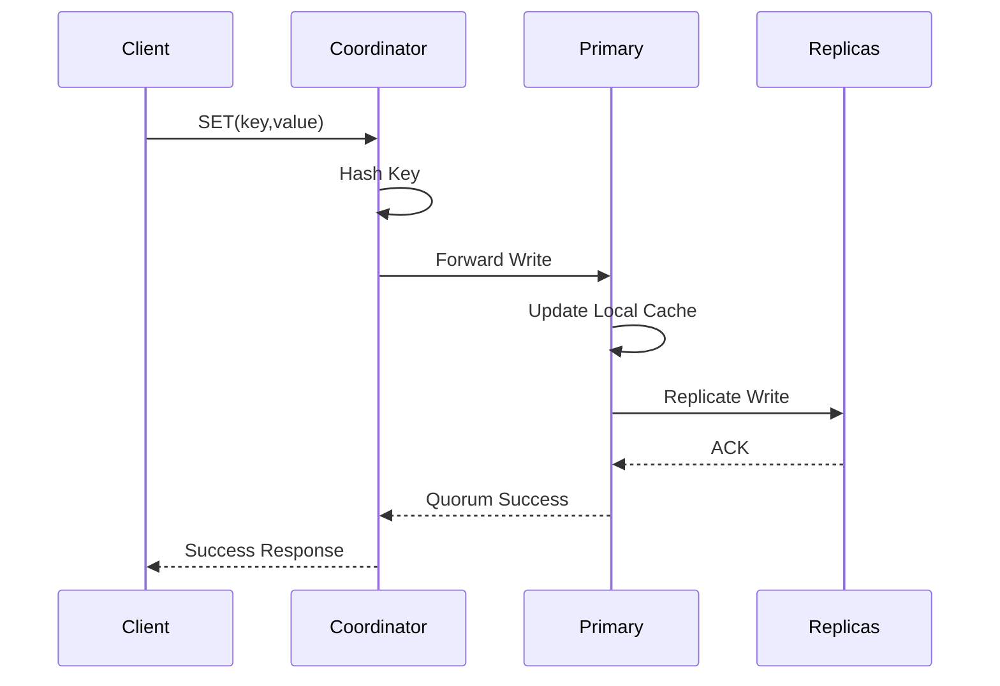
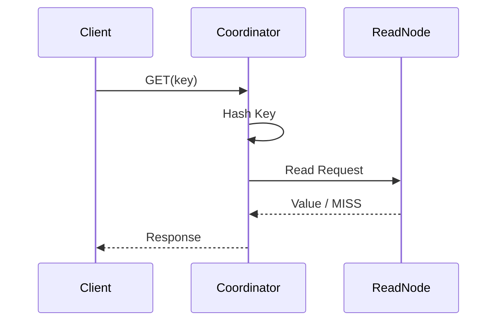
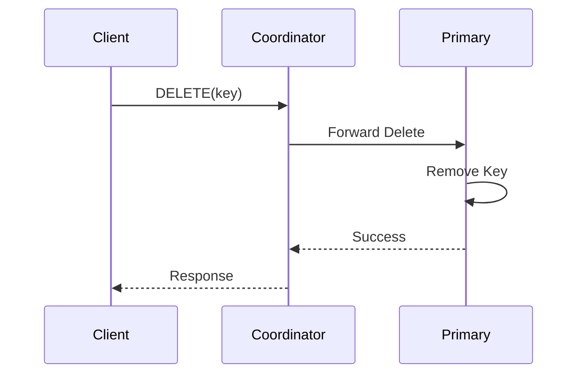
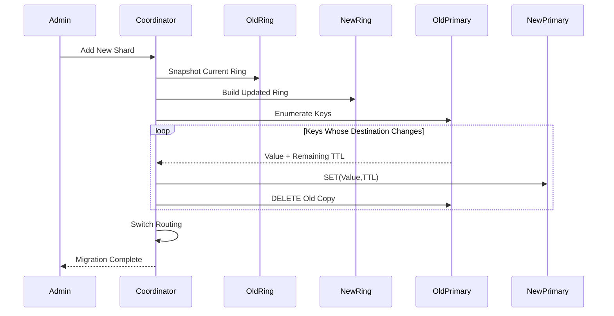
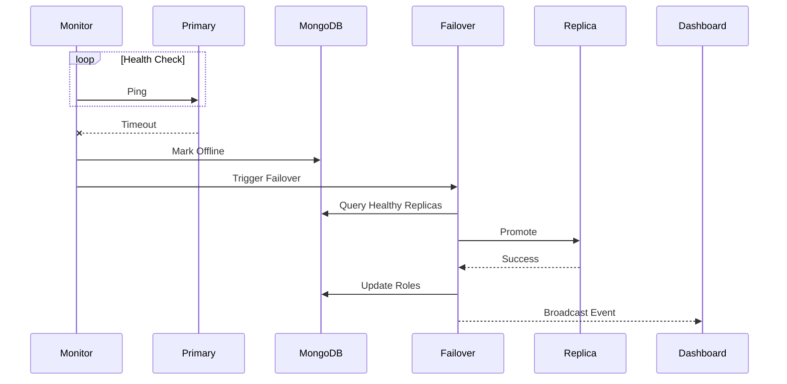

<h1 align="center">
🚀 Distributed Cache System
</h1>

<p align="center">
A high-performance distributed in-memory key-value cache built with <b>C++20</b>, <b>Node.js</b>, <b>React</b>, <b>MongoDB</b>, and <b>Docker</b>.
</p>

<p align="center">


</p>

---

# 📖 Overview

Distributed Cache System is an engineering prototype that explores the design and implementation of a distributed in-memory key-value cache.

The project combines:

- ⚡ A concurrent **C++20 cache engine**
- 🌐 A **Node.js / Express coordinator**
- 🗄️ **MongoDB** backed cluster metadata
- 📊 A **React monitoring dashboard**
- 🐳 Docker Compose deployment

The system is organized into **shards**, where every shard contains a **Primary** and one or more **Replica** nodes.

The coordinator is responsible for:

- Routing client requests
- Determining shard ownership
- Replicating writes
- Health monitoring
- Automatic failover
- Online shard migration
- Cluster metadata management

---

> **Project Status**
>
> This repository is an educational distributed-systems implementation created to study caching, replication, failover, routing, migration, concurrency, and monitoring.
>
> It is **not intended as a production replacement for Redis.**

---

# ✨ Features

## ⚡ High Performance Cache Engine

- Average **O(1)** GET / SET / DELETE using `std::unordered_map`
- Thread-safe concurrent cache
- Doubly linked list for access-order tracking
- LRFU-inspired eviction policy
- Ordered TTL scheduling
- Background expiration worker
- Lazy expiration on reads
- Cache statistics
- HTTP/JSON API

---

## 🔄 Replication & Failover

- Primary–Replica architecture
- Quorum-based replication
- Automatic replica promotion
- Health monitoring
- Retry after topology changes
- Replication-offset aware promotion
- Thread-safe peer management

---

## 🌍 Sharding & Routing

- Deterministic hashing
- Binary-search shard lookup
- O(1) read-node selection
- Configurable read pools
- Health-aware routing
- Background key migration
- Lazy read migration
- TTL preservation

---

## 📊 Monitoring

- Node.js Coordinator
- MongoDB cluster metadata
- Socket.IO live updates
- React Dashboard
- Throughput metrics
- Latency metrics
- Failover notifications
- Cluster topology visualization

---

## 🧪 Testing

- Unit Tests
- Concurrent Benchmarks
- Throughput Reporting
- Docker Deployment
- GitHub Actions

---

# ⚙️ Complexity Analysis

| Operation | Complexity | Implementation |
|-----------|------------|----------------|
| GET | Average **O(1)** | `unordered_map` |
| SET | Average **O(1)** | Hash Table |
| DELETE | Average **O(1)** | Hash Table |
| TTL Scheduling | **O(log N)** | Ordered expiration structure |
| Shard Lookup | **O(log S)** | Binary Search |
| Read Node Selection | **O(1)** | Eligible Pool |
| Ring Rebuild | **O(S log S)** | Sorted shard positions |
| Migration | **O(K log S)** | Rehashing |

Where

- **N** = Keys inside a cache node
- **S** = Number of shards
- **K** = Keys evaluated during migration

---

# 📚 Table of Contents

- 📖 Overview
- ✨ Features
- ⚙️ Complexity Analysis
- 🏗️ System Architecture
- 🔄 Request Workflow
- 🔁 Online Shard Expansion
- ❤️ Health Monitoring & Failover
- 🧠 Cache Engine Design
- 💻 Tech Stack
- 📁 Repository Structure
- 🚀 Getting Started
- 🧪 Testing & Benchmarking
- 🔌 API Overview
- ⚠️ Limitations
- 🛣️ Future Improvements
- 🤝 Contributing
- 📄 License

---

# 🏗️ System Architecture


---

# 🔄 Request Workflow

Every client request first reaches the **Coordinator**, which determines the responsible shard before forwarding the request to the appropriate cache node.

---

## ✍️ Write Path



### Flow

1. Client sends a **SET** request.
2. Coordinator hashes the key.
3. Binary search identifies the target shard.
4. Write is forwarded to the Primary.
5. Primary updates its local cache.
6. Replicas receive the write.
7. Operation succeeds after the required quorum acknowledges.
8. Coordinator logs the operation and responds.

---

## 📖 Read Path



### Flow

- Client sends a GET request.
- Coordinator determines the shard.
- A healthy node is selected from the read pool.
- During migration, fallback to the previous topology is supported.
- Missing keys can be migrated lazily.
- Remaining TTL is preserved throughout migration.

---

## ❌ Delete Path



During online migration:

- Deletes are propagated to both old and new destinations.
- Prevents stale copies after topology updates.
- Maintains cache consistency throughout migration.

---

# 🔁 Online Shard Expansion

One of the major capabilities of the system is **online shard expansion**, allowing new shards to be introduced without stopping client traffic.



---

## Migration Strategy

Instead of blocking every request during shard expansion, the coordinator maintains **two routing topologies** simultaneously.

### During Migration

✅ Normal reads continue

✅ Normal writes continue

✅ Previous routing remains available

✅ Lazy-read migration supported

✅ Remaining TTL preserved

✅ Stale copies removed automatically

✅ Additional topology updates are queued until migration finishes

---

### Why this approach?

Compared with pausing the cluster during rebalancing, this strategy provides:

- Lower service disruption
- Smaller migration batches
- Continuous client availability
- Reduced latency spikes
- Incremental shard scaling

---

# ❤️ Health Monitoring & Automatic Failover

Node health is continuously monitored through heartbeat checks.

If a Primary repeatedly fails to respond, the coordinator automatically promotes the most suitable Replica.



---

## Failover Process

1. Coordinator detects consecutive heartbeat failures.
2. Node is marked unavailable.
3. Healthy replicas are ranked using:
   - Replication offset
   - Uptime
   - Health status
4. Best replica becomes the new Primary.
5. Routing tables are rebuilt.
6. Dashboard receives live failover events.
7. Subsequent client requests are automatically redirected.

---

> **Note**
>
> The current implementation performs automated failover and promotion but **does not claim linearizability, consensus-based election, or split-brain prevention** under arbitrary network partitions.

---

---

# 🧠 Cache Engine Design

The cache engine is implemented in **modern C++20** and is designed around a combination of high-performance data structures to provide fast lookups, efficient eviction, and concurrent access.

## 🏛️ Internal Architecture

```text
                    Cache Engine

                  +----------------+
                  | HTTP Server    |
                  +--------+-------+
                           |
                           v
                 +---------+----------+
                 | Cache Manager      |
                 +---------+----------+
                           |
      +--------------------+---------------------+
      |                    |                     |
      v                    v                     v
+------------+     +----------------+     +--------------+
| Hash Table |     | LRFU List      |     | TTL Scheduler|
+------------+     +----------------+     +--------------+
      |                    |                     |
      +--------------------+---------------------+
                           |
                    Cache Statistics
```

---

## ⚡ Core Components

### 🗂️ Hash Table

Responsible for average **O(1)** key lookup.

- Stores cache entries
- Maps keys to values
- Maintains iterators for fast deletion
- Provides constant-time access

---

### 📋 Access List

A doubly linked list maintains access ordering.

Responsibilities:

- Tracks recently used entries
- Supports efficient eviction
- Constant-time insertion
- Constant-time removal

---

### ⏳ TTL Scheduler

TTL expiration is handled using an ordered expiration structure.

Features include:

- O(log N) scheduling
- Background cleanup thread
- Lazy expiration during reads
- Remaining TTL preservation during migration

---

### 📊 Statistics Collector

Tracks runtime metrics including:

- Cache Hits
- Cache Misses
- Writes
- Deletes
- Evictions
- Expired Keys

These metrics are exposed to the monitoring dashboard.

---

# 🔥 LRFU-Inspired Eviction

When the cache reaches capacity, eviction is performed using an **LRFU-inspired policy**.

Instead of implementing strict **LRU** or strict **LFU**, the engine combines both **recency** and **frequency**.

### Eviction Process

1. Cache reaches maximum capacity.
2. A bounded set of oldest entries is examined.
3. Access frequencies are compared.
4. Least valuable candidate is selected.
5. Entry is removed.
6. New key is inserted.

---

### Why LRFU?

| Policy | Weakness |
|---------|----------|
| LRU | Frequently accessed old items may be evicted |
| LFU | Old hot entries may remain forever |
| **LRFU-Inspired** | Balances both recency and frequency |

This hybrid strategy improves cache efficiency under mixed workloads.

---

# 🔒 Thread Safety

The cache engine is designed for concurrent execution.

Synchronization is achieved using:

- `std::mutex`
- `std::lock_guard`
- Atomic counters
- Background worker threads

Shared cache state is protected while allowing efficient concurrent request processing.

---

# 💻 Technology Stack

## 🚀 Cache Engine

| Technology | Purpose |
|------------|----------|
| C++20 | Core Engine |
| CMake | Build System |
| STL | Data Structures |
| std::thread | Concurrency |
| std::mutex | Synchronization |
| cpp-httplib | HTTP Server |
| nlohmann/json | JSON Serialization |

---

## 🌐 Coordinator Backend

| Technology | Purpose |
|------------|----------|
| Node.js | Runtime |
| Express | REST APIs |
| MongoDB | Metadata Storage |
| Axios | Internal Communication |
| Socket.IO | Live Dashboard Updates |

---

## 🎨 Frontend

| Technology | Purpose |
|------------|----------|
| React | UI |
| Vite | Build Tool |
| Socket.IO Client | Live Metrics |
| CSS | Styling |

---

## 🐳 Infrastructure

| Tool | Purpose |
|------|----------|
| Docker | Containerization |
| Docker Compose | Multi-Service Deployment |
| GitHub Actions | Continuous Integration |

---

# 📁 Repository Structure

```text
Distributed-Cache-System
│
├── .github/
│   └── workflows/
│
├── benchmarks/
│
├── coordinator-backend/
│   ├── server/
│   │   ├── models/
│   │   ├── routes/
│   │   ├── middleware/
│   │   ├── services/
│   │   └── utils/
│
├── coordinator-frontend/
│
├── cpp-cache-engine/
│
├── src/
│
├── tests/
│
├── docker-compose.yml
│
└── README.md
```

---

# 🚀 Getting Started

## Prerequisites

Before running the project, install:

- Docker
- Docker Compose
- Git

---

## 1️⃣ Clone Repository

```bash
git clone https://github.com/Rudy-123/Distributed-Cache-System.git

cd Distributed-Cache-System
```

---

## 2️⃣ Build the Cluster

```bash
docker compose up --build -d
```

---

## 3️⃣ Verify Services

```bash
docker compose ps
```

---

## 4️⃣ View Logs

Entire cluster:

```bash
docker compose logs -f
```

Specific service:

```bash
docker compose logs -f <service-name>
```

---

## 5️⃣ Access Services

| Service | Default Address |
|----------|-----------------|
| Dashboard | http://localhost:3000 |
| Coordinator API | http://localhost:5000 |
| Primary Cache Node | http://localhost:5051 |

> Additional ports can be found inside `docker-compose.yml`.

---

## 6️⃣ Stop Cluster

```bash
docker compose down
```

Remove associated volumes:

```bash
docker compose down -v
```

---

# 🧪 Testing & Benchmarking

## Unit Tests

The test suite validates:

- Cache SET
- Cache GET
- Cache DELETE
- Cache Hits
- Cache Misses
- Capacity Eviction
- TTL Expiration
- Concurrent Access
- Multithreaded Correctness

Build and execute the test target using the CMake configuration inside **cpp-cache-engine**.

---

## Throughput Benchmark

The benchmark measures:

- Successful Operations
- Failed Operations
- Elapsed Time
- Operations / Second

The benchmark is designed for repeatable functional testing and throughput evaluation.

Current implementation does **not** claim:

- p50 latency
- p95 latency
- p99 latency
- Production-scale benchmarking

---

# 🔌 API Overview

The **Coordinator** exposes APIs for:

- Cache GET
- Cache SET
- Cache DELETE
- Cluster Status
- Node Registration
- Authentication
- Monitoring Data

---

Each **C++ Cache Node** exposes internal endpoints for:

- Cache Operations
- Health Checks
- Replication
- Peer Registration
- Leader Promotion
- Statistics
- Key Enumeration
- Migration Support

Refer to the source code for the exact endpoint definitions.
---

# 🌟 Why This Project?

This project demonstrates the implementation of several core distributed systems concepts within a single end-to-end application.

### Key Engineering Highlights

- ⚡ High-performance concurrent cache engine written in **C++20**
- 🌍 Deterministic sharding with binary-search based routing
- 🔄 Primary–Replica replication with quorum-based writes
- ❤️ Automatic health monitoring and failover
- 🔁 Online shard expansion with background key migration
- ⏳ TTL-aware cache with background expiration
- 📊 Real-time monitoring dashboard built with **React** and **Socket.IO**
- 🐳 Fully containerized deployment using **Docker Compose**
- 🧪 Unit testing and concurrent throughput benchmarking

The project combines systems programming, distributed systems, backend development, frontend visualization, and DevOps into a single engineering prototype.


# 📊 Project Statistics

| Category | Implementation |
|-----------|---------------|
| Language | C++20 |
| Backend | Node.js + Express |
| Frontend | React |
| Database | MongoDB |
| Deployment | Docker Compose |
| Communication | HTTP + JSON |
| Monitoring | Socket.IO |
| Build System | CMake |
| Testing | Unit Tests + Benchmarks |

---

# 🤝 Contributing

Contributions are welcome!

If you'd like to improve the project, feel free to open an issue or submit a pull request.

## Development Workflow

### 1. Fork the repository

Click the **Fork** button at the top-right of the GitHub page.

---

### 2. Clone your fork

```bash
git clone https://github.com/<your-username>/Distributed-Cache-System.git

cd Distributed-Cache-System
```

---

### 3. Create a feature branch

```bash
git checkout -b feature/amazing-feature
```

---

### 4. Commit your changes

```bash
git commit -m "Add amazing feature"
```

---

### 5. Push the branch

```bash
git push origin feature/amazing-feature
```

---

### 6. Open a Pull Request

Describe the motivation, implementation details, and testing performed.

---

## Contribution Guidelines

Please ensure that:

- Code follows the existing style.
- Documentation is updated.
- New functionality includes tests where applicable.
- Pull requests remain focused on a single feature.

---

# 📜 License

Distributed Cache System is licensed under the **MIT License**.

See the **LICENSE** file for additional details.

---
